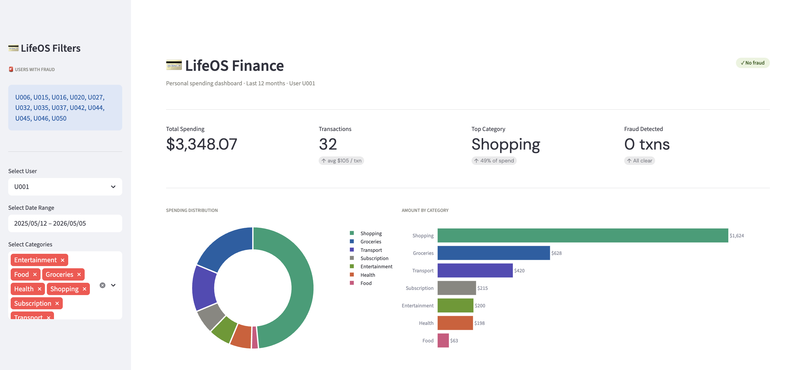
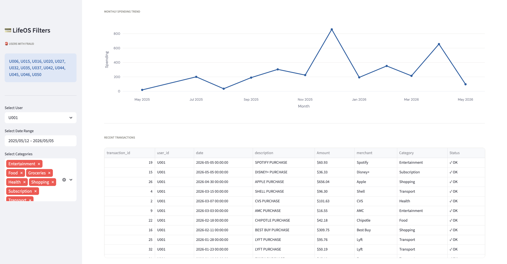
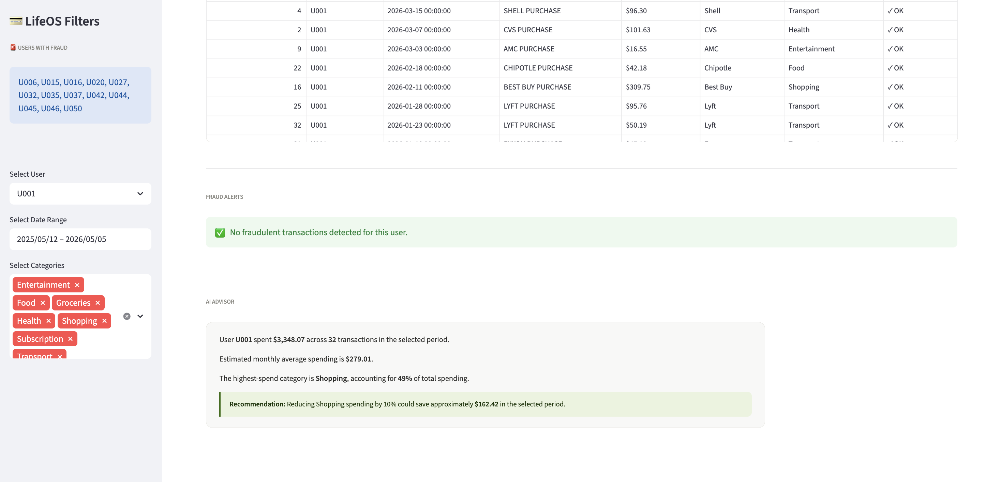
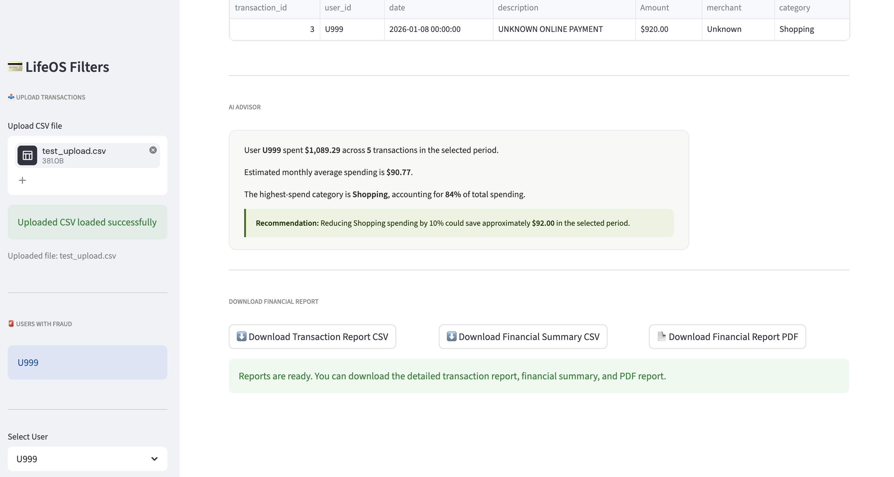
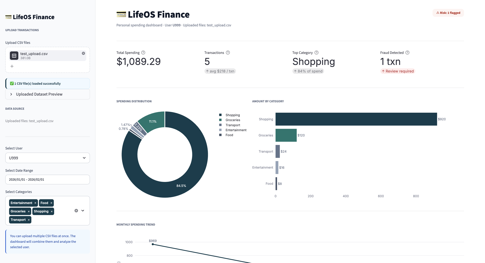
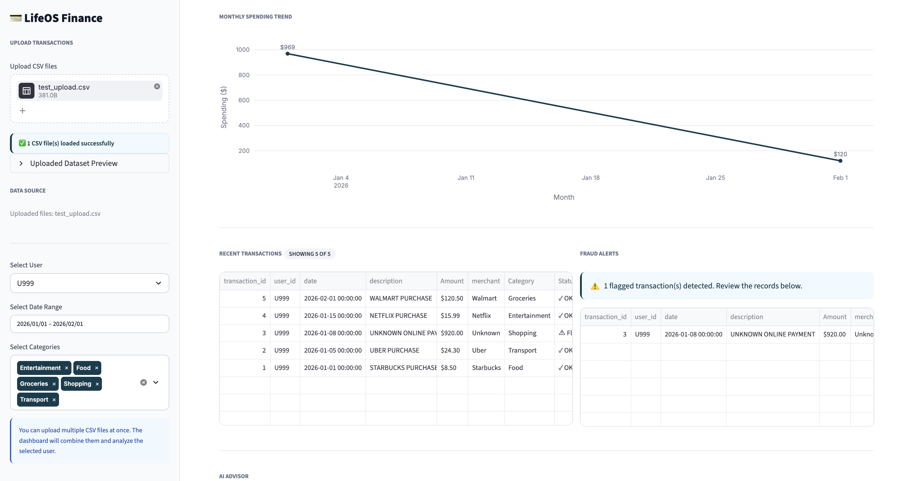
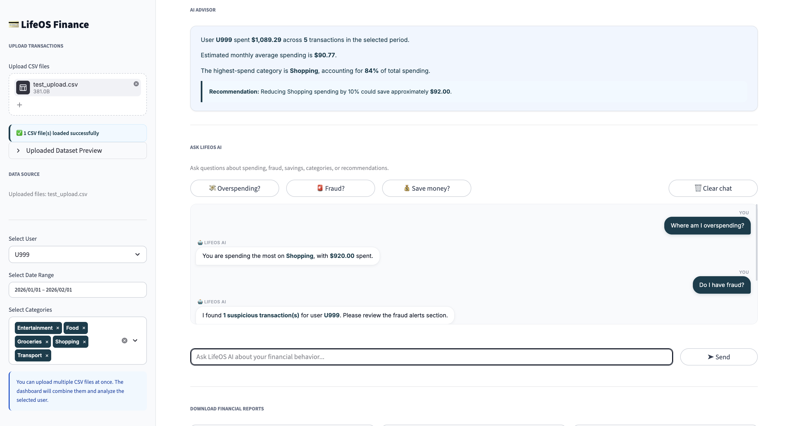
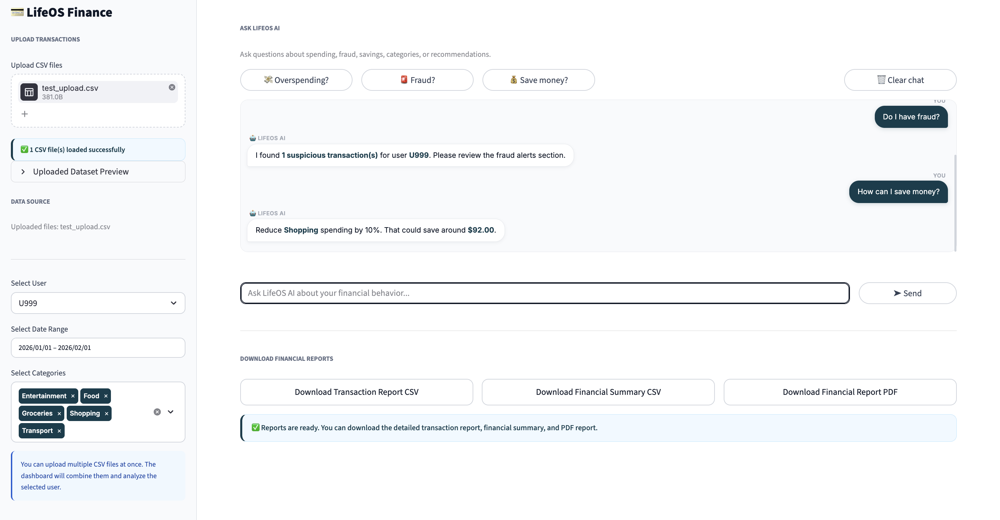

# LifeOS AI — Personal Finance Intelligence Platform

> An AI-powered personal finance analytics platform combining machine learning, REST APIs, interactive dashboards, fraud detection, downloadable reports, and AI-generated financial insights to help users make smarter financial decisions.

---

## Table of Contents

- [Overview](#overview)
- [Features](#features)
- [Machine Learning Models](#machine-learning-models)
- [Tech Stack](#tech-stack)
- [Project Structure](#project-structure)
- [Installation](#installation)
- [Running the Application](#running-the-application)
- [API Reference](#api-reference)
- [Dashboard](#dashboard)
- [Changelog](#changelog)
- [Roadmap](#roadmap)

---

## Overview

LifeOS AI is a full-stack fintech analytics system that combines machine learning, backend APIs, intelligent financial insights, and interactive data visualization to deliver actionable personal finance intelligence.

The platform supports dynamic transaction uploads, fraud analysis, AI-generated recommendations, downloadable financial reports, and multi-user financial analytics. It serves as the **financial intelligence layer** of the broader LifeOS AI ecosystem — an AI platform focused on intelligent life management and behavioral analytics.

---

## Features

### 🧠 Smart Transaction Categorization

Automatically classifies transaction descriptions into meaningful categories using NLP-based machine learning.

| Input Description | Predicted Category |
|---|---|
| `DOORDASH PURCHASE` | 🍔 Food |
| `UBER TRIP` | 🚗 Transport |
| `NETFLIX PAYMENT` | 🎬 Entertainment |
| `WHOLE FOODS MARKET` | 🛒 Groceries |

**Supported categories:** Food · Groceries · Shopping · Entertainment · Transport · Health · Subscription

---

### 🔍 Fraud Detection

Detects suspicious transactions using anomaly detection, flagging:

- High-value or unusual transactions
- Purchases from unknown merchants
- Abnormal spending patterns
- Potential fraudulent activity

> ⚠️ **Example:** `UNKNOWN ONLINE PAYMENT — $950.00` → **Fraud Alert**

---

### 📈 Budget Forecasting

Predicts future spending trends to help users stay ahead of their finances:

- Monthly spending trend analysis
- Spending behavior tracking
- Budget overrun insights
- Forward-looking financial analytics

---

### 👥 Spending Pattern Analysis

Clusters users into spending profiles using unsupervised machine learning.

| Profile | Description |
|---|---|
| **High Spender** | Consistently above-average transaction amounts |
| **Food-Heavy** | Majority of spend in dining and groceries |
| **Subscription-Heavy** | High recurring monthly charges |
| **Balanced** | Evenly distributed spending behavior |

---

### 💡 AI Financial Advisor

Generates personalized financial recommendations based on spending behavior:

- Reduce shopping expenses
- Lower subscription costs
- Improve savings rate
- Detect unusual spending trends
- Suggest financial optimization strategies

---

### 📤 CSV Upload Support

Upload one or multiple CSV files simultaneously. The dashboard automatically merges and analyzes all uploaded datasets together, with a collapsible preview of the combined data directly in the sidebar.

---

### 📄 Downloadable Financial Reports

Generate and download:

- Transaction CSV reports
- Financial summary CSV reports
- Professional PDF financial reports

---

### 📊 Interactive Multi-User Analytics

Analyze financial behavior using:

- User-level filtering
- Date & category filtering
- Fraud-user tracking
- Dynamic dashboard updates

---

### 💬 AI Chat Assistant *(Updated)*

Ask questions about spending, fraud, savings, and financial behavior through a fully redesigned chat interface featuring:

- **Custom chat bubble UI** — styled user and bot message bubbles rendered via `components.html`
- **Quick-prompt pill buttons** — one-click prompts: 💸 Overspending?, 🚨 Fraud?, 💰 Save money?
- **Inline chat input** — text field + Send button integrated directly below the chat window
- **Clear chat button** — reset conversation history at any time
- **Auto-scroll** — chat window always scrolls to the latest message

---

## Machine Learning Models

| Module | Algorithm |
|---|---|
| Transaction Categorization | TF-IDF + Logistic Regression |
| Fraud Detection | Isolation Forest |
| Budget Forecasting | Linear Regression |
| Spending Pattern Analysis | K-Means Clustering |
| Financial Advisor | Rule-Based AI Engine |

---

## Tech Stack

### Backend
- **FastAPI** — REST API framework
- **Uvicorn** — ASGI server
- **Python 3.9+**

### Machine Learning
- **Scikit-learn** — ML models and pipelines
- **Pandas & NumPy** — Data processing
- **Joblib** — Model serialization

### Frontend
- **Streamlit** — Interactive dashboard
- **Plotly** — Interactive visualizations

### Data & Reporting
- **Faker** — Synthetic transaction generation
- **ReportLab** — PDF report generation

---

## Project Structure

```
lifeos-ai-finance/
│
├── backend/
│   └── app/
│       └── main.py
│
├── frontend/
│   └── app.py
│
├── ml_models/
│   ├── categorizer/
│   ├── fraud_detector/
│   ├── forecaster/
│   ├── clustering/
│   └── advisor/
│
├── data/
│   ├── transactions.csv
│   └── test_upload.csv
│
├── uploads/
│
├── scripts/
│   └── generate_dataset.py
│
├── screenshots/
│
├── requirements.txt
└── README.md
```

---

## Installation

### Prerequisites

- Python 3.9+
- pip

### 1. Clone the Repository

```bash
git clone <https://github.com/kavyasruthi58/lifeos-ai-finance.git>
cd lifeos-ai-finance
```

### 2. Create a Virtual Environment

```bash
# macOS / Linux
python3 -m venv venv
source venv/bin/activate

# Windows
python3 -m venv venv
venv\Scripts\activate
```

### 3. Install Dependencies

```bash
pip install -r requirements.txt
```

---

## Running the Application

### Start the FastAPI Backend

```bash
python -m uvicorn backend.app.main:app --reload
```

| Resource | URL |
|---|---|
| API Base | http://127.0.0.1:8000 |
| Swagger Docs | http://127.0.0.1:8000/docs |

### Start the Streamlit Dashboard

```bash
streamlit run frontend/app.py
```

| Resource | URL |
|---|---|
| Dashboard | http://localhost:8501 |

---

## API Reference

| Method | Endpoint | Description |
|---|---|---|
| `POST` | `/predict/category` | Classify transactions |
| `POST` | `/predict/fraud` | Fraud prediction |
| `POST` | `/predict/budget` | Spending forecast |
| `GET` | `/advisor/summary` | AI recommendations |
| `GET` | `/health` | API health check |

---

## Dashboard

The Streamlit dashboard provides a complete AI-powered financial analytics experience:

- User-level financial analytics
- Interactive category & date filtering
- Multi-file CSV upload with sidebar preview
- Spending distribution charts
- Monthly spending trend analysis (with single-month bar chart fallback)
- Fraud detection alerts with header risk badge
- AI-generated financial recommendations
- Redesigned AI chat assistant with bubble UI and quick-prompt buttons
- Downloadable CSV & PDF financial reports
- Multi-user transaction analytics

---

## Screenshots

### ⬅️ Before Updates

> Original dashboard — basic chat input, single CSV upload, no risk badge, plain success alerts.






---

### ➡️ After Updates *(Latest — Today)*

> Redesigned dashboard — custom chat bubbles, quick-prompt pills, multi-file upload with preview, header risk/safe badge, branded teal alerts, and single-month chart fallback.



 
---

## Changelog

### 🆕 Latest Update

#### ✅ New Features

| Feature | Description |
|---|---|
| **Custom Chat Bubble UI** | Replaced `st.chat_message` with fully custom HTML/CSS chat bubbles rendered via `components.html`. User messages appear right-aligned in teal; bot responses appear left-aligned in white with border. |
| **Quick-Prompt Pill Buttons** | Added three one-click prompt buttons — 💸 *Overspending?*, 🚨 *Fraud?*, 💰 *Save money?* — so users can explore insights without typing. |
| **Clear Chat Button** | Added a 🗑 *Clear chat* button to reset the conversation history at any time. |
| **Inline Chat Input** | Replaced `st.chat_input` with a combined `st.text_input` + Send button layout for a tighter, more polished chat experience. |
| **Multi-File CSV Upload** | Sidebar now accepts multiple CSV files at once. All uploaded files are merged into a single unified dataset for analysis. |
| **Uploaded Dataset Preview** | A collapsible expander in the sidebar shows a 10-row preview of the merged uploaded dataset. |
| **Header Risk / Safe Badge** | A dynamic badge in the dashboard header shows ⚠ *Risk: N flagged* (red) or ✓ *All clear* (green) based on fraud detection results for the selected user. |
| **Single-Month Chart Fallback** | When only one month of data is present, the monthly trend section now renders a bar chart instead of a meaningless flat line, with an explanatory annotation. |
| **Branded Teal Alert Styling** | All Streamlit success/info alerts have been overridden with the brand teal color (`#0F3D4C`) to replace Streamlit's default green — applied globally including the sidebar CSV upload confirmation. |
| **Auto-Scroll Chat Window** | The chat bubble container auto-scrolls to the latest message via injected JavaScript. |

---

#### 🔁 Changed / Improved

| Area | Before | After |
|---|---|---|
| Chat interface | `st.chat_input` + `st.chat_message` (default Streamlit style) | Custom HTML/CSS bubble UI via `components.html` |
| CSV upload | Single file upload | Multiple files accepted and merged automatically |
| Monthly trend chart | Always rendered as a line chart (flat/broken with one month) | Falls back to bar chart for single-month datasets |
| Success alerts | Streamlit default green | Brand teal (`#0F3D4C`) with left border accent |
| Header | Title + subtitle only | Title + subtitle + dynamic risk/safe badge |
| Sidebar data feedback | Plain `st.success()` text | Styled teal info box with file count confirmation |

---

## Roadmap

Planned enhancements for future releases:

- [ ] BERT-based NLP transaction categorization
- [ ] XGBoost fraud detection
- [ ] LSTM / Prophet time-series forecasting
- [ ] OpenAI / Groq-powered AI assistant
- [ ] PostgreSQL database integration
- [ ] Docker containerization
- [ ] AWS cloud deployment
- [ ] Apache Kafka real-time streaming pipeline
- [ ] Login & authentication system
- [ ] Multi-user role-based analytics
- [ ] Real-time fraud alerts
- [ ] AI financial chatbot

---

<div align="center">

Built as part of the **LifeOS AI** initiative — an AI ecosystem focused on intelligent life management, behavioral analytics, and human-centered AI systems.

</div>